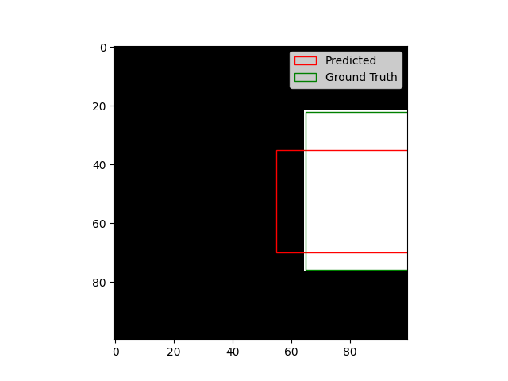

# Simple Object Detection using Convolutional Neural Network
Object detection is one of the fundamental problem in computer vision. Given an image, the goal is to detect the objects within
the image, by generating a rectangular box (bounding box) around the objects. Obviously, there can be multiple objects in an 
image of same or different classes. Object detection deals with identifying each of these objects. However, in this project 
we are just concerned with a detecting a single object.

## Model Architecture
Our model consists of three convolutional layers and two fully connected layers. A kernel of size 5 with stride 1 is used in 
each of the convolutional layers and rectified linear units, ReLU, is used as activation function. A max pooling layer of filter 
size 2 with stride 2 is employed after each of the first two convolutional layers. 

## Training
We have trained the network for 30 epochs using stochastic gradient descent (SGD). We normalize the images by dividing them by 255, 
such that the pixels are in the space [0,1]. Likewise, we normalize the box coordinates such that they are in the space [0,1]. 
At test time, we have to make sure to undo this.

## Dataset
The dataset we have used here is very simple and is generated in python. Each image is 100x100x1 and has a small rectangular 
box of random size and shape and at random positions. For background the color value is set to 0 and for box it is set to 255. 
The training dataset has 1000 of such images and the test dataset consists of 200 images. The corresponding ground truth 
information are stored in separate file.
